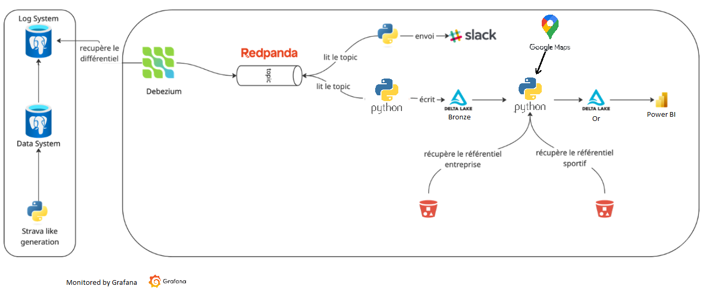
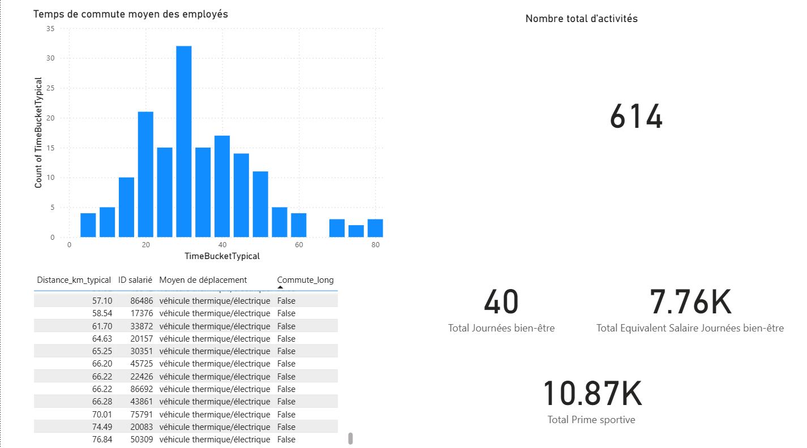

# employee-activity-etl-poc

### Schema de l'organisation du projet




### Resultats dans Power BI




# Pour lancer le project

.\venv\Scripts\activate.bat

```
docker-compose start
```
or 
```
docker-compose restart
```

### lancer le bot slack
```
cd slack_bot
py slack_notifier.py
```
S'il est necessaire de reset le bot (reset l'offset Redpanda)
```
py slack_notifier.py --reset
```

### Lancer le monitoring
```
docker start grafana loki prometheus postgres-exporter
```


### Supprimer redpanda topic (debezium le relance automatiquement)
```
docker exec -it redpanda /bin/bash
```
```
rpk topic list
rpk topic delete pg_cdc.public.employee_activities
```
Utile pour repartir de zero


### Bronze to gold
```
cd bronze
py redPandaToDeltaLake.py
```
```
cd gold
py bronzeToGold.py
```

### Supprimer des lignes de PG admin (pour tester le bon fonctionnement de RedPanda)


in pgAdmin


delete last 7 entries :

```
DELETE FROM employee_activities 
WHERE "ID" IN (
  SELECT "ID" 
  FROM employee_activities 
  ORDER BY "ID" DESC 
  LIMIT 7
);
```

delete all

```
DELETE FROM employee_activities;
```
